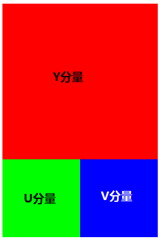
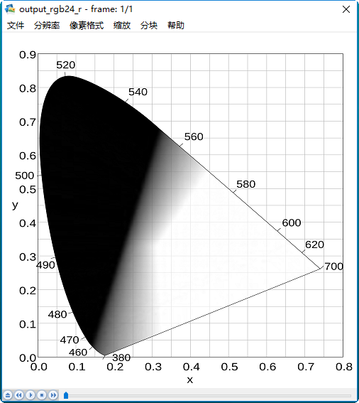

# 视音频数据处理入门

 
 

## 准备
yuv视频下载：
>http://trace.eas.asu.edu/yuv/ 

yuv播放器：[修改了一个YUV/RGB播放器](http://blog.csdn.net/leixiaohua1020/article/details/50466201)

>注意： 
>本文中像素的采样位数一律为8bit。由于1Byte=8bit，所以一个像素的一个分量的采样值占用1Byte。 
>输出的U、V分量在YUV播放器中也是当做Y分量进行播放的。 

 
 

## 分离YUV420P像素数据中的Y、U、V分量
> 如果视频帧的宽和高分别为w和h，那么一帧YUV420P像素数据一共占用w*h*3/2 Byte的数据。其中前w * h Byte存储Y，接着的w * h * 1/4 Byte存储U，最后w * h * 1/4 Byte存储V。

yuv420p像素数据排列如下图。原图像分辨率为256 * 256，所以Y分量分辨率为256 * 256，U分量分辨率为128 * 128，V分量分辨率为128 * 128： 

yuv420_split.cpp 程序中的函数可以将YUV420P数据中的Y、U、V三个分量分离开来并保存成三个文件。

调用方法：
> ./yuv420_split  ./mediadata/lena_256x256_yuv420p.yuv 256 256

上述代码运行后，将会把一张分辨率为256x256的名称为lena_256x256_yuv420p.yuv的YUV420P格式的像素数据文件分离成为三个文件：

- output_420_y.y：纯Y数据，分辨率为**256x256**。注意播放时设置播放器分辨率。
- output_420_u.y：纯U数据，分辨率为**128x128**。注意播放时设置播放器分辨率。
- output_420_v.y：纯V数据，分辨率为**128x128**。注意播放时设置播放器分辨率。

 
 

## 分离YUV444P像素数据中的Y、U、V分量
> 说明：如果视频帧的宽和高分别为w和h，那么一帧YUV444P像素数据一共占用w * h * 3 Byte的数据。其中前w * h Byte存储Y，接着的w * h Byte存储U，最后w * h Byte存储V。

调用方法：
> ./yuv444p_split ./mediadata/lena_256x256_yuv444p.yuv 256 256

上述代码运行后，将会把一张分辨率为256x256的名称为lena_256x256_yuv444p.yuv的YUV444P格式的像素数据文件分离成为三个文件：

- output_444_y.y：纯Y数据，分辨率为**256x256**。
- output_444_u.y：纯U数据，分辨率为**256x256**。
- output_444_v.y：纯V数据，分辨率为**256x256**。

 
 

## 分离YUV422P像素数据中的Y、U、V分量（还有问题，图像显示不完整）
> 说明：对于YUV422P的格式，表示平面格式(Planar)，即Y、U、V是分开存储的，每个分量占一块地方，其中Y为width * height，而U、V合占width * height。根据U、V的顺序，分出2种格式，U前V后即YUV422P，也叫I422，V前U后，叫YV16(YV表示Y后面跟着V，16表示16bit)。

调用方法：
> ./yuv422p_split ./mediadata/lena_256x256_yuv422p.yuv 256 256

上述代码运行后，将会把一张分辨率为256x256的名称为lena_256x256_yuv422p.yuv的YUV422P格式的像素数据文件分离成为三个文件：

- output_422p_y.y：纯Y数据，分辨率为**256x256**。
- output_422p_u.y：纯U数据，分辨率为**128x128**。
- output_422p_v.y：纯V数据，分辨率为**128x128**。

 
 

## 将YUV420P像素数据去掉颜色（变成灰度图）
>说明：如果想把YUV格式像素数据变成灰度图像，只需要将U、V分量设置成128即可。这是因为U、V是图像中的经过偏置处理的色度分量。色度分量在偏置处理前的取值范围是-128至127，这时候的无色对应的是“0”值。经过偏置后色度分量取值变成了0至255，因而此时的无色对应的就是128了。

调用方法：
> ./yuv420p_gray ./mediadata/lena_256x256_yuv420p.yuv 256 256

上述代码运行后，将会把一张分辨率为256x256的名称为lena_256x256_yuv420p.yuv的YUV420P格式的像素数据文件处理成名称为output_420p_gray.yuv的YUV420P格式的像素数据文件。

 
 

## 将YUV420P像素数据的周围加上边框
> 说明：本程序将距离图像边缘border范围内的像素的Y分量、U分量、Y分量的取值设置成了最大值255。

调用方法：
> ./yuv420p_border ./mediadata/lena_256x256_yuv420p.yuv 256 256 30

上述代码运行后，将会把一张分辨率为256x256的名称为lena_256x256_yuv420p.yuv的YUV420P格式的像素数据文件处理成名称为output_420p_border.yuv的YUV420P格式的像素数据文件。输入的原图如下所示。

   

 
 

## 将YUV420P像素数据的亮度减半
>说明：如果打算将图像的亮度减半，只要将图像的每个像素的Y值取出来分别进行除以2的工作就可以了。图像的每个Y值占用1 Byte，取值范围是0至255，对应C语言中的unsigned char数据类型。

调用方法：
> ./yuv420p_half_y ./mediadata/lena_256x256_yuv420p.yuv 256 256

上述代码运行后，将会把一张分辨率为256x256的名称为lena_256x256_yuv420p.yuv的YUV420P格式的像素数据文件处理成名称为output_420p_half_y.yuv的YUV420P格式的像素数据文件。

 
 

## 分离RGB24像素数据中的R、G、B分量
> 说明：与YUV420P三个分量分开存储不同，RGB24格式的每个像素的三个分量是连续存储的。一帧宽高分别为w、h的RGB24图像一共占用w * h * 3 Byte的存储空间。RGB24格式规定首先存储第一个像素的R、G、B，然后存储第二个像素的R、G、B…以此类推。类似于YUV420P的存储方式称为Planar方式，而类似于RGB24的存储方式称为Packed方式。

调用方法：
> ./rgb24_split ./mediadata/cie1931_500x500.rgb 500 500

上述代码运行后，将会把一张分辨率为500x500的名称为cie1931_500x500.rgb的RGB24格式的像素数据文件分离成为三个文件：

- output_r.y：R数据，分辨率为**500x500**。
- output_g.y：G数据，分辨率为**500x500**。
- output_b.y：B数据，分辨率为**500x500**。

输入的原图是一张标准的CIE 1931色度图。该色度图右下为红色，上方为绿色，左下为蓝色，如下图所示：

 

R数据图像如图所示： 

G数据图像如图所示： 

B数据图像如图所示： 

 
 

参考：[视音频数据处理入门：RGB、YUV像素数据处理](http://blog.csdn.net/leixiaohua1020/article/details/50534150)

